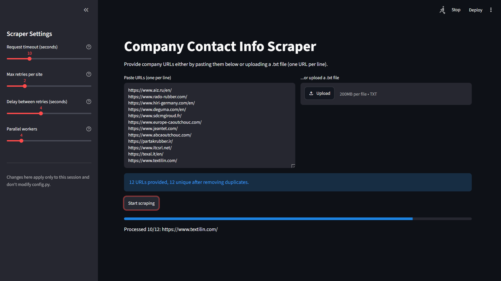
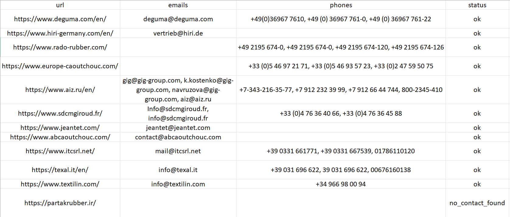

# Company Contact Info Scraper


A Python tool for extracting company contact information — emails and phone numbers — from a list of company websites, with automatic contact-page discovery, multi-language support, retry handling, and concurrent execution. Available both as a command-line tool and as a Streamlit web app.

> Built as a practical B2B lead-generation and market-research tool: give it a list of company websites, get back a clean spreadsheet of contact data.

## Why this project

Manually visiting dozens or hundreds of company websites to collect contact details is slow and repetitive — a common task in market research, sales prospecting, and B2B lead generation. This tool automates that pipeline end-to-end: from a plain list of URLs to a ready-to-use spreadsheet, handling the messy realities of real websites (missing contact pages, inconsistent phone formats, non-English content, and unreliable connections) along the way.

## Features

- **Automatic contact-page discovery** — follows "Contact" links when info isn't on the homepage, using keyword sets for multiple languages (English, Russian, Persian, German, French, Spanish, Chinese)
- **Automatic language detection** — detects page language from the `<html lang>` attribute or character analysis, and picks the right contact-page keywords accordingly
- **Retry logic** — automatically retries failed requests before giving up, instead of dropping sites on the first timeout
- **Concurrent scraping** — processes multiple websites in parallel using a thread pool, significantly reducing total runtime
- **Duplicate URL detection** — normalizes and deduplicates input URLs (ignoring protocol, case, and trailing slashes)
- **Two interfaces**:
  - a **CLI** driven by a plain `.txt` input file, with a live progress bar
  - a **Streamlit web app** where URLs can be pasted or uploaded, with in-app configuration controls and a downloadable Excel result
- **Formatted Excel output** — bold headers, auto-sized columns, frozen header row
- **Error logging** — every failed or empty result is logged with a timestamp instead of being silently lost
- **Centralized configuration** — all tunable parameters (timeouts, retries, thread count, keyword lists, regex patterns) live in a single `config.py`
- **Unit tested** — core extraction and deduplication logic is covered by a `pytest` test suite

## Demo

**Streamlit interface:**


**Sample Excel output:**


## Project Structure

```
company-contact-scraper/
├── src/
│   ├── config.py          # All tunable settings
│   ├── scraper.py         # Core scraping logic (fetch, parse, extract)
│   ├── main.py             # CLI entry point (reads examples/input.txt)
│   └── app.py               # Streamlit web app
├── tests/
│   └── test_scraper.py       # Unit tests for core functions
├── examples/
│   └── input.txt             # Sample input file
├── docs/
│   └── screenshot.png        # App/output screenshot for this README
├── requirements.txt
├── .gitignore
├── .gitattributes
├── LICENSE
└── README.md
```

## How It Works

```
Input: list of company URLs
        │
        ▼
  Deduplicate URLs
        │
        ▼
  For each URL (in parallel, with retries):
        │
        ├─ Fetch homepage HTML
        ├─ Detect page language
        ├─ Extract emails / phones from homepage
        │
        ├─ Found? ──Yes──► done
        │
        No
        ▼
        ├─ Find contact page link (language-aware keywords)
        ├─ Fetch + parse contact page
        └─ Extract emails / phones
        │
        ▼
  Collect results → Excel + error log
```

## Installation

```bash
git clone https://github.com/mhmdrza-mp4/company-contact-scraper.git
cd company-contact-scraper
pip install -r requirements.txt
```

## Usage

### Option 1 — Command line

1. Add URLs to `examples/input.txt` (one per line):
```
https://example-company1.com
https://example-company2.com
```

2. Run:
```bash
cd src
python main.py
```

3. Output:
- `companies_output.xlsx` — extracted data
- `errors.log` — any failures, with timestamps

### Option 2 — Streamlit web app

```bash
cd src
streamlit run app.py
```

Then, in the browser tab that opens:
1. Adjust scraper settings in the sidebar if needed (request timeout, retries, retry delay, parallel workers) — these override the defaults from `config.py` for that session only
2. Paste URLs or upload a `.txt` file
3. Click **Start scraping**
4. Watch the live progress bar
5. Download the results as an Excel file directly from the page

## Configuration

All settings are in `src/config.py`, including:

| Setting | Purpose |
|---|---|
| `REQUEST_TIMEOUT` | Seconds to wait for a response |
| `MAX_RETRIES` / `RETRY_DELAY` | Retry behavior on failed requests |
| `MAX_WORKERS` | Number of websites processed in parallel |
| `CONTACT_KEYWORDS` | Per-language keywords for finding the contact page |
| `PHONE_PATTERNS` | Regex patterns for different phone number formats |

The four request/concurrency settings (timeout, retries, retry delay, parallel workers) can also be adjusted directly from the Streamlit app's sidebar without editing this file — useful for quick experimentation. Sidebar changes only apply to the current session.

## Running Tests

The project includes a unit test suite covering the core extraction and deduplication logic.

```bash
pip install pytest  # already included in requirements.txt
pytest tests/
```

## Limitations

- Static HTML only — JavaScript-rendered sites (React/Vue/Angular) may return incomplete data without a headless browser
- Regex-based phone extraction, which may need tuning for uncommon regional formats
- No CAPTCHA or anti-bot bypass
- Only checks the homepage and one detected contact page, not a full site crawl

## Contributing

This started as a personal learning project, but suggestions and pull requests are welcome — especially around additional language/keyword support for contact-page detection, and better phone number patterns for regions not yet covered.

If you'd like to contribute, feel free to open an issue first to discuss the change.

## License

This project is licensed under the MIT License — see [LICENSE](LICENSE) for details.
