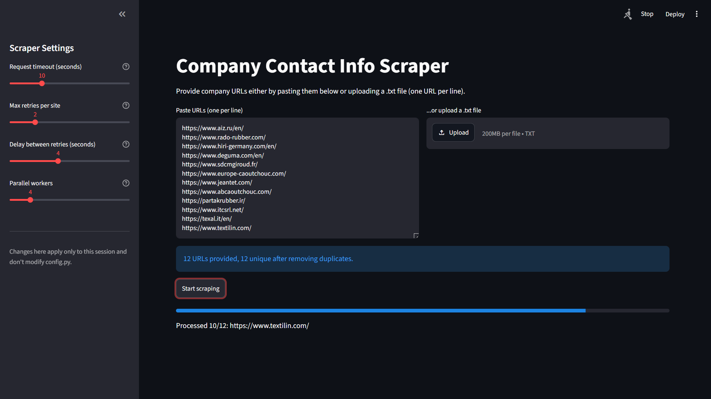
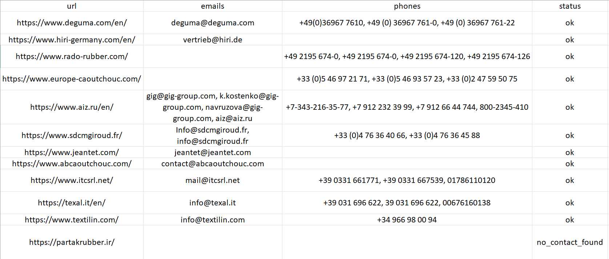

# Company Contact Info Scraper


Extract emails and phone numbers from company websites. Give it a list of URLs, get back a clean spreadsheet. Available as a CLI tool and a Streamlit web app.

## Why this project

Visiting dozens or hundreds of company websites to collect contact details is slow and repetitive. This tool automates that pipeline end-to-end — from a plain list of URLs to an Excel file — handling the messy realities of real websites (missing contact pages, inconsistent phone formats, non-English content, unreliable connections) along the way.

## Features

- **Automatic contact-page discovery** — follows "Contact" links when info isn't on the homepage, using keyword sets for English, Russian, Persian, German, French, Spanish, and Chinese
- **Automatic language detection** — detects page language from `<html lang>`, character analysis (Cyrillic, Persian, CJK), or common-word frequency, then picks the right contact-page keywords
- **Retry logic** — retries failed requests before giving up
- **Concurrent scraping** — processes multiple websites in parallel via a thread pool
- **Duplicate URL detection** — normalizes and deduplicates input URLs (ignoring protocol, case, trailing slashes, www prefix)
- **Per-domain politeness delay** — avoids hammering the same host with back-to-back requests
- **SSRF protection** — blocks requests to private/loopback/link-local IPs
- **Two interfaces**:
  - a **CLI** with a `.txt` input file, configurable arguments, and a progress bar
  - a **Streamlit web app** with in-app configuration and downloadable Excel output
- **Formatted Excel output** — bold headers, auto-sized columns, frozen header row
- **Error logging** — failed or empty results are logged with timestamps
- **Centralized configuration** — all tunable parameters (timeouts, retries, thread count, keywords, regex patterns) in `config.py`
- **Installable package** — structured with `pyproject.toml`, installable via `pip install -e .`
- **Unit tested** — core extraction, deduplication, language detection, and pipeline logic covered by `pytest`
- **CI pipeline** — GitHub Actions runs tests on every push and pull request

## Demo

**Streamlit interface:**


**Sample Excel output:**


## Project Structure

```
company-contact-scraper/
├── src/
│   └── company_scraper/        # Installable Python package
│       ├── __init__.py
│       ├── config.py           # All tunable settings
│       ├── scraper.py          # Core scraping logic (fetch, parse, extract)
│       ├── main.py             # CLI entry point
│       └── app.py              # Streamlit web app
├── tests/
│   └── test_scraper.py         # Unit tests
├── examples/
│   └── input.txt               # Sample input file
├── docs/
│   ├── streamlit-demo.png      # Streamlit app screenshot
│   └── excel-output.png        # Excel output screenshot
├── .github/
│   └── workflows/
│       └── ci.yml              # GitHub Actions CI
├── pyproject.toml              # Package metadata & build config
├── requirements.txt            # Pinned dependencies
├── .gitignore
├── .gitattributes
├── LICENSE
└── README.md
```

## How It Works

```
Input: list of company URLs
        │
        ▼
  Deduplicate URLs (normalize www, protocol, case, trailing slash)
        │
        ▼
  For each URL (in parallel, with retries & per-domain delay):
        │
        ├─ Fetch homepage HTML
        ├─ Detect page language (lang attr → character analysis → word frequency)
        ├─ Extract emails / phones from homepage
        │
        ├─ Found? ──Yes──► done
        │
        No
        ▼
        ├─ Find contact page link (scored keyword matching, nav preferred)
        ├─ Fetch + parse contact page
        └─ Extract emails / phones
        │
        ▼
  Collect results (preserve input order) → Excel + error log
```

## Installation

```bash
git clone https://github.com/mhmdrza-mp4/company-contact-scraper.git
cd company-contact-scraper
pip install -e .
```

Or with requirements only:

```bash
pip install -r requirements.txt
```

## Usage

### Option 1 — Command line

1. Add URLs to `examples/input.txt` (one per line):
```
https://example-company1.com
https://example-company2.com
```

2. Run:
```bash
python -m company_scraper.main -i examples/input.txt -o output.xlsx
```

All arguments:

| Flag | Default | Description |
|------|---------|-------------|
| `-i` / `--input` | `examples/input.txt` | Input file with URLs |
| `-o` / `--output` | `companies_output.xlsx` | Output Excel file |
| `-w` / `--workers` | `8` | Number of parallel workers |
| `-t` / `--timeout` | `10` | Request timeout in seconds |

3. Output:
- `output.xlsx` — extracted data
- `errors.log` — any failures, with timestamps

### Option 2 — Streamlit web app

```bash
streamlit run src/company_scraper/app.py
```

Then, in the browser tab that opens:
1. Adjust scraper settings in the sidebar if needed (request timeout, retries, retry delay, parallel workers)
2. Paste URLs or upload a `.txt` file
3. Click **Start scraping**
4. Watch the live progress bar
5. Download the results as an Excel file directly from the page

## Configuration

All settings are in `src/company_scraper/config.py`, including:

| Setting | Purpose |
|---|---|
| `REQUEST_TIMEOUT` | Seconds to wait for a response |
| `MAX_RETRIES` / `RETRY_DELAY` | Retry behavior on failed requests |
| `PER_DOMAIN_DELAY` | Minimum delay between requests to the same host |
| `MAX_WORKERS` | Number of websites processed in parallel |
| `CONTACT_KEYWORDS` | Per-language keywords for finding the contact page |
| `PHONE_PATTERNS` | Regex patterns for different phone number formats |
| `MAX_URLS_STREAMLIT` | Maximum URLs allowed in the Streamlit app |

The four request/concurrency settings (timeout, retries, retry delay, parallel workers) can also be adjusted from the Streamlit sidebar without editing this file. Sidebar changes only apply to the current session.

## Running Tests

```bash
pip install pytest  # already included in requirements.txt
pytest tests/ -v
```

## Limitations

- Static HTML only — JavaScript-rendered sites (React/Vue/Angular) may return incomplete data without a headless browser
- Regex-based phone extraction, which may need tuning for uncommon regional formats
- No CAPTCHA or anti-bot bypass
- Only checks the homepage and one detected contact page, not a full site crawl

## Contributing

Suggestions and pull requests are welcome — especially around additional language/keyword support for contact-page detection, and better phone number patterns for uncovered regions.

Open an issue first to discuss the change.

## License

This project is licensed under the MIT License — see [LICENSE](LICENSE) for details.
